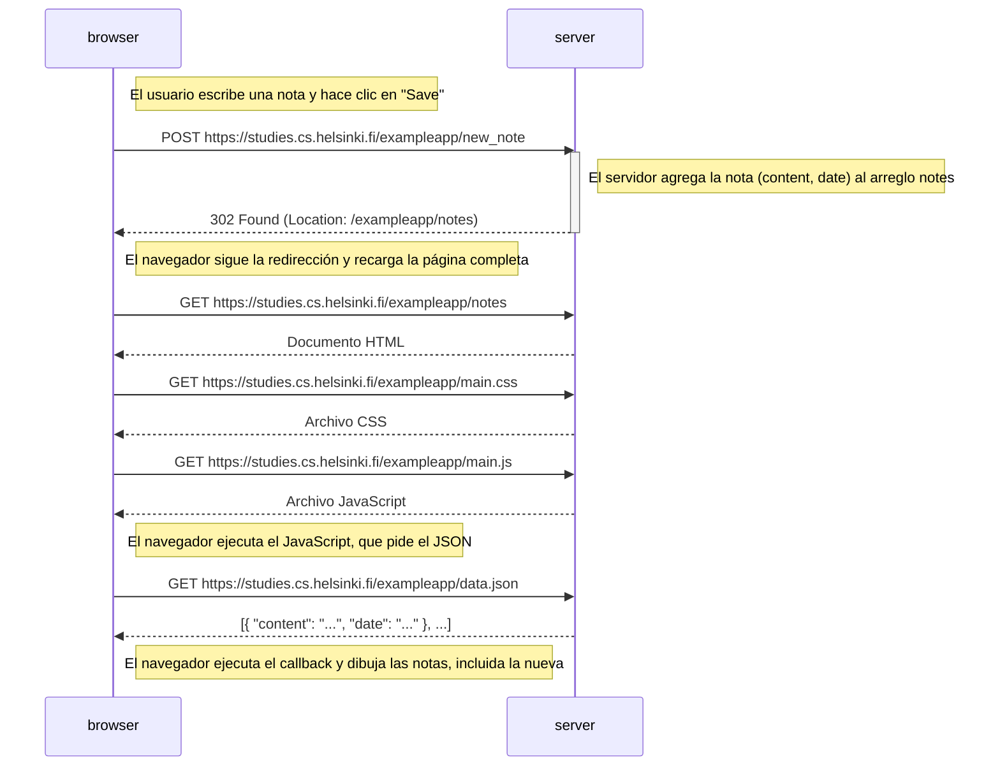
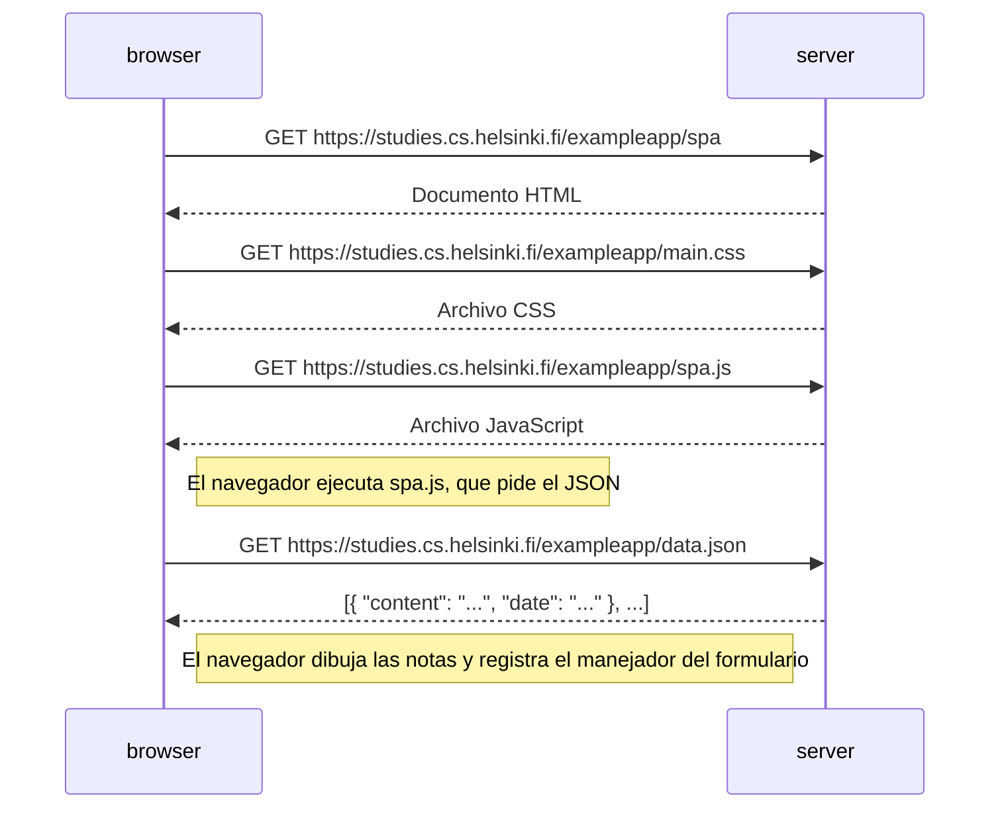
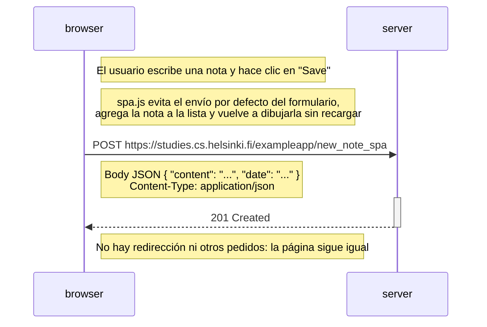

# Parte 0 - Fundamentos de las aplicaciones web

## 0.4 Nuevo diagrama de nota

```mermaid
sequenceDiagram
    participant browser
    participant server

    Note right of browser: El usuario escribe una nota y hace clic en "Save"
    browser->>server: POST https://studies.cs.helsinki.fi/exampleapp/new_note
    activate server
    Note right of server: El servidor agrega la nota (content, date) al arreglo notes
    server-->>browser: 302 Found (Location: /exampleapp/notes)
    deactivate server

    Note right of browser: El navegador sigue la redirección y recarga la página completa
    browser->>server: GET https://studies.cs.helsinki.fi/exampleapp/notes
    server-->>browser: Documento HTML
    browser->>server: GET https://studies.cs.helsinki.fi/exampleapp/main.css
    server-->>browser: Archivo CSS
    browser->>server: GET https://studies.cs.helsinki.fi/exampleapp/main.js
    server-->>browser: Archivo JavaScript

    Note right of browser: El navegador ejecuta el JavaScript, que pide el JSON
    browser->>server: GET https://studies.cs.helsinki.fi/exampleapp/data.json
    server-->>browser: [{ "content": "...", "date": "..." }, ...]
    Note right of browser: El navegador ejecuta el callback y dibuja las notas, incluida la nueva
```

## 0.5 Diagrama de aplicación de una sola página (SPA)

```mermaid
sequenceDiagram
    participant browser
    participant server

    browser->>server: GET https://studies.cs.helsinki.fi/exampleapp/spa
    server-->>browser: Documento HTML
    browser->>server: GET https://studies.cs.helsinki.fi/exampleapp/main.css
    server-->>browser: Archivo CSS
    browser->>server: GET https://studies.cs.helsinki.fi/exampleapp/spa.js
    server-->>browser: Archivo JavaScript

    Note right of browser: El navegador ejecuta spa.js, que pide el JSON
    browser->>server: GET https://studies.cs.helsinki.fi/exampleapp/data.json
    server-->>browser: [{ "content": "...", "date": "..." }, ...]
    Note right of browser: El navegador dibuja las notas y registra el manejador del formulario
```

## 0.6 Nuevo diagrama de nota en la SPA

```mermaid
sequenceDiagram
    participant browser
    participant server

    Note right of browser: El usuario escribe una nota y hace clic en "Save"
    Note right of browser: spa.js evita el envío por defecto del formulario,<br/>agrega la nota a la lista y vuelve a dibujarla sin recargar
    browser->>server: POST https://studies.cs.helsinki.fi/exampleapp/new_note_spa
    Note right of browser: Body JSON { "content": "...", "date": "..." }<br/>Content-Type: application/json
    activate server
    server-->>browser: 201 Created
    deactivate server
    Note right of browser: No hay redirección ni otros pedidos: la página sigue igual
```
